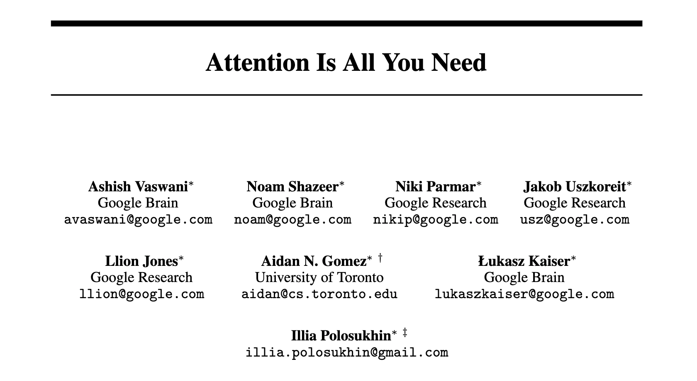

# PicX

**From discovery to deep reading — an all-in-one paper workstation.**

Track what the AI community is talking about, discover papers worth reading in any field, read them in full text with an AI at your side, and turn any of them into a visual whiteboard in one click.

Free, open source, and running entirely on Cloudflare's edge. Live at **[picx.dev](https://picx.dev)**.

If you find this project helpful, please consider giving it a star ⭐

English | [简体中文](README.zh-CN.md)

## Demo




## Features

### Track

- **AI news feed** (`/news`) — hourly aggregation from lab blogs, researcher blogs, X and Hacker News. An LLM pipeline scores relevance, writes a gist, links related coverage, picks a lead image, and de-duplicates by embedding. Unhealthy sources trip a circuit breaker and heal on their own.
- **Weekly Gallery** (`/gallery`) — every week's picks as a browsable edition, with per-direction issues, category pages and a full archive.
- **Direction digests** — a Cloudflare Workflow mines each tracked research direction weekly across arXiv, RSS and Semantic Scholar, then scores, deep-reads, verifies and synthesizes the result into an issue. A three-month freshness gate keeps stale material out.

### Discover

- **Research assistant** (`/assistant`) — an agent that searches the web for papers worth reading. Generation is hosted in a Durable Object, so a dropped connection never loses a reply and sessions resume cleanly.
- **Skills** (`/assistant/skills`) — reusable instruction sets for the assistant. Ships with built-in ones and lets you write your own.

### Read

- **Paper workstation** (`/papers`, `/p/{shortId}`) — upload a PDF or paste an arXiv link. Papers are parsed to full text via MinerU, then summarized, TLDR'd and translated into all four supported languages.
- **Dual reader** — a typography-tuned full-text reader with KaTeX and code highlighting, plus the original PDF. Select any sentence to ask about it.
- **Sharing** — short links, generated share images, and `/p/{shortId}.md` for LLM-friendly plain Markdown.

### Discuss

- **Paper chatbot** — go deep section by section with the paper in context.

### Plus

- **One-click whiteboards** — turn any paper into a visual whiteboard image, with a shared prompt library at `/whiteboard-prompts`.
- **Credits & BYOK** — daily check-in credits and a transaction history at `/credits`; bring your own API keys at `/api-configs` (stored encrypted).
- **AI visibility (GEO)** — `/llms.txt`, `/llms-full.txt`, per-paper Markdown via content negotiation, sitemap, and IndexNow push.
- **Auto-posting** — a daily cron posts the top picks to X.
- **PWA** — installable, with a mobile tab bar.
- **Internationalization** — full support for English, Simplified Chinese, Traditional Chinese and Japanese.

## Tech Stack

### Frontend

- **Framework**: TanStack Start (Router, Query, Form, Table, Store)
- **UI**: Shadcn UI on Radix, Tailwind CSS v4
- **Reader**: pdf.js, react-markdown, KaTeX
- **i18n**: Paraglide JS

### Backend

- **Runtime**: Cloudflare Workers
- **Database**: Cloudflare D1 (SQLite) with Drizzle ORM
- **Storage**: Cloudflare R2
- **Async**: Cloudflare Queues (paper processing), Workflows (weekly digests), Durable Objects (chat hosting), Cron Triggers
- **Embeddings**: Workers AI
- **API**: tRPC
- **Auth**: Better Auth with GitHub OAuth
- **AI**: Vercel AI SDK v7 via OpenAI-compatible endpoints, OpenRouter and Gemini

### Development

- **Language**: TypeScript
- **Build**: Vite
- **Lint & Format**: Biome
- **Testing**: Vitest

## Getting Started

### Prerequisites

- **Node.js 24+** and npm
- A Cloudflare account (for deployment; local development runs against Wrangler's local emulation)

### Installation

```bash
git clone https://github.com/liuchengwucn/picx.git
cd picx
npm install
```

### Environment variables

```bash
cp .dev.vars.example .dev.vars
```

`.dev.vars` is read by Wrangler at runtime and by Drizzle Kit via dotenv. The minimum to boot locally:

| Variable | Notes |
| --- | --- |
| `BETTER_AUTH_SECRET` | Generate with `npx -y @better-auth/cli secret` |
| `BETTER_AUTH_URL` | `http://localhost:3000` |

To exercise the AI features you'll also want `OPENAI_API_KEY` / `OPENAI_BASE_URL` / `OPENAI_MODEL` (summaries, chat), `GEMINI_API_KEY` / `GEMINI_BASE_URL` / `GEMINI_MODEL` (whiteboard generation) and `MINERU_TOKEN` (PDF → full text, from [mineru.net](https://mineru.net)). GitHub login needs `GITHUB_CLIENT_ID` / `GITHUB_CLIENT_SECRET`.

Everything else — news aggregation, direction digests, X posting, Telegram alerts, IndexNow, admin access — is optional and documented inline in `.dev.vars.example` .

### Database

```bash
# Generate migration files after changing src/db/schema.ts
npm run db:generate

# Apply migrations to the local D1 emulation
npx wrangler d1 migrations apply picx-db --local
```

> **Migrations always go through Wrangler.** `db:migrate`, `db:push` and `db:pull` are deliberately blocked — `drizzle-kit migrate` would replay from `0000` (and `0001`/`0002` contain `DELETE`s), and `push`/`pull` bypass migration history entirely.

### Run

```bash
npm run dev      # http://localhost:3000
npm run build    # production build (does NOT typecheck)
npm run preview
```

## Scripts

| Command | What it does |
| --- | --- |
| `npm run dev` | Dev server on port 3000 |
| `npm run build` | Vite production build — no type checking |
| `npm run test` | Vitest |
| `npm run typecheck` | `tsc --noEmit` |
| `npm run check` | Biome check **and** typecheck — use this before committing |
| `npm run lint` / `npm run format` | Biome individually |
| `npm run db:generate` | Generate Drizzle migrations |
| `npm run db:studio` | Drizzle Studio |
| `npm run deploy` | Build and `wrangler deploy` |

## Deployment

Deploys to Cloudflare Workers with `npm run deploy`. Workflows and Durable Objects are created by the deploy itself; the stateful resources below have to exist first.

```bash
# D1 — then put the returned id into wrangler.jsonc
npx wrangler d1 create picx-db
npx wrangler d1 migrations apply picx-db --remote

# R2 (production + preview)
npx wrangler r2 bucket create picx-papers-apac --location apac
npx wrangler r2 bucket create picx-papers-apac-preview --location apac

# Queues (the dead-letter queue must exist too)
npx wrangler queues create paper-processing
npx wrangler queues create paper-processing-dlq
```

Secrets go through Wrangler rather than into files:

```bash
npx wrangler secret put BETTER_AUTH_SECRET
npx wrangler secret put GITHUB_CLIENT_ID
npx wrangler secret put GITHUB_CLIENT_SECRET
npx wrangler secret put OPENAI_API_KEY
npx wrangler secret put GEMINI_API_KEY
npx wrangler secret put MINERU_TOKEN
npx wrangler secret put API_KEY_ENCRYPTION_SECRET   # encrypts user-supplied API keys
```

`wrangler.jsonc` also registers six cron triggers: a daily arXiv ingest, three staggered X posts, an hourly news pipeline, and the weekly direction digest. Note that Cloudflare's cron weekday field is `1 = Sunday .. 7 = Saturday`, which is why the digest uses the `SAT` abbreviation.

## Project Structure

```
picx/
├── src/
│   ├── routes/          # File-based routing (pages + API routes)
│   ├── components/      # React components
│   ├── lib/             # Domain logic: papers, news, digest, chat, skills, GEO
│   ├── workers/         # Cron handlers and the paper-processing queue consumer
│   ├── workflows/       # Cloudflare Workflows (weekly direction digest)
│   ├── integrations/    # tRPC routers, Better Auth, TanStack Query setup
│   ├── db/              # Drizzle schema
│   └── paraglide/       # Generated i18n runtime
├── drizzle/             # D1 migrations
├── messages/            # i18n message catalogs (en, zh-CN, zh-TW, ja)
├── scripts/             # Backfill and seed scripts
├── test/                # Test helpers and mocks
└── wrangler.jsonc       # Workers config: bindings, crons, queues, workflows
```

## License

This project is licensed under the MIT License — see the [LICENSE](LICENSE) file for details.
